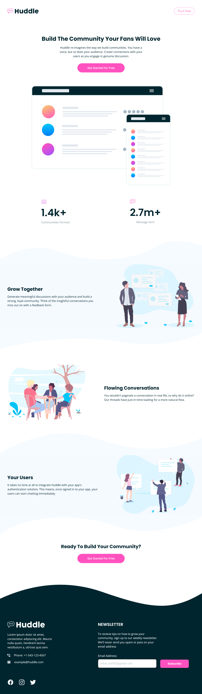
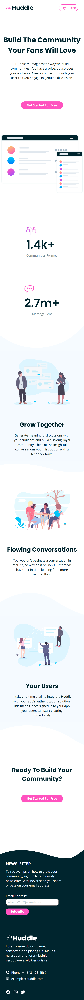

# Huddle Landing Page with Curved Sections

This is a fully responsive landing page for **Huddle**, a fictional company, designed as part of the [Frontend Mentor](https://www.frontendmentor.io) challenges. The project features curved sections, a modern layout, and a clean design. It is built using **HTML**, **CSS**.

## Table of Contents

- [Overview](#overview)
  - [The Challenge](#the-challenge)
  - [Screenshots](#screenshots)
  - [Links](#links)
- [My Process](#my-process)
  - [Built With](#built-with)
  - [What I Learned](#what-i-learned)
  - [Continued Development](#continued-development)
  - [Useful Resources](#useful-resources)
- [Author](#author)
- [Acknowledgments](#acknowledgments)

## Overview

### The Challenge

The goal of this project was to build a responsive landing page for Huddle with curved sections. The design was provided by Frontend Mentor, and the challenge was to replicate the design as closely as possible while ensuring the page is fully responsive across all devices.

**Requirements:**
- Replicate the design provided by Frontend Mentor.
- Ensure the page is fully responsive (desktop, tablet, and mobile).
- Add hover states for interactive elements.
- Use semantic HTML and maintain clean, reusable CSS.

### Screenshots

| Desktop View | Mobile View |
|--------------|-------------|
|  |  |

### Links

- **Live Site URL:** [https://saharzakersoltani.github.io/huddle-landing-page-with-curved-sections-master/](https://saharzakersoltani.github.io/huddle-landing-page-with-curved-sections-master/)
- **GitHub Repository:** [https://github.com/saharzakersoltani/huddle-landing-page-with-curved-sections-master](https://github.com/saharzakersoltani/huddle-landing-page-with-curved-sections-master)

## My Process

### Built With

- **HTML5**: Semantic markup for better accessibility and SEO.
- **CSS3**: Flexbox, Grid, and custom properties for styling.
- **Responsive Design**: Media queries for mobile, tablet, and desktop views.
- **BEM Methodology**: For clean and maintainable CSS.
- **Git & GitHub**: For version control and deployment.

### What I Learned

- **Curved Sections**: I learned how to create curved sections using CSS properties like `border-radius` and `clip-path`.
- **Responsive Design**: I improved my skills in creating responsive layouts using media queries and flexible units like `rem`, `em`, and `%`.
- **BEM Methodology**: I practiced using the BEM (Block, Element, Modifier) naming convention to write clean and maintainable CSS.
- **Accessibility**: I ensured the page is accessible by using semantic HTML and ARIA attributes where necessary.

### Continued Development

In future projects, I plan to:
- Explore more advanced CSS techniques like animations and transitions.
- Dive deeper into JavaScript to add more interactivity.
- Learn about performance optimization for faster page loads.

### Useful Resources

- [Frontend Mentor](https://www.frontendmentor.io) - For providing the design and challenge.
- [CSS-Tricks](https://css-tricks.com) - For helpful articles on CSS techniques.
- [MDN Web Docs](https://developer.mozilla.org) - For comprehensive documentation on HTML, CSS, and JavaScript.
- [BEM Methodology](http://getbem.com/) - For understanding BEM naming conventions.

## Author

- **Sahar Zaker Soltani**
  - GitHub: [saharzakersoltani](https://github.com/saharzakersoltani)
  - Frontend Mentor: [@saharzakersoltani](https://www.frontendmentor.io/profile/saharzakersoltani)
  - Email: [sahar.zs2002.com](mailto:your-email@example.com)

## Acknowledgments

I would like to thank [Frontend Mentor](https://www.frontendmentor.io) for providing this challenge. It was a great opportunity to practice and improve my frontend development skills. Special thanks to the community for their support and feedback!
